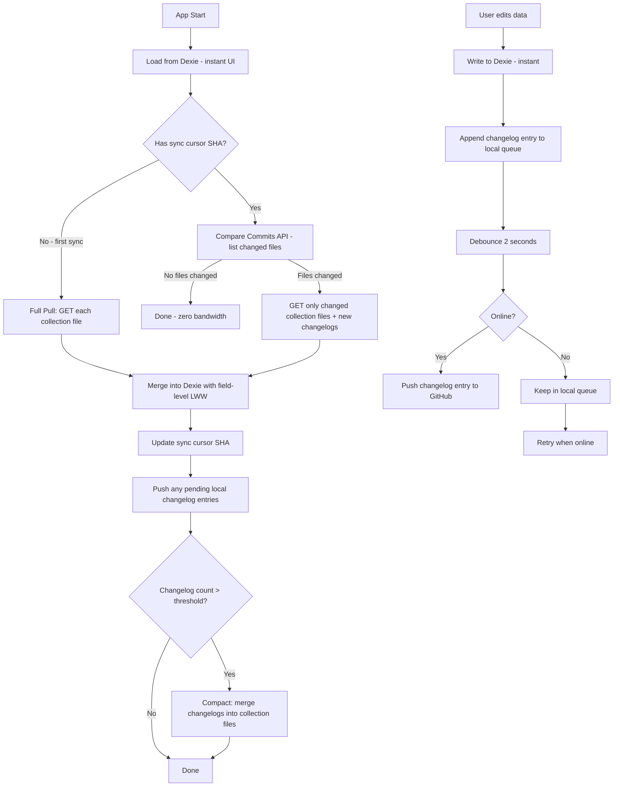

# GitHub as a Free Database Backend — Refined Plan v2

> **Revision of** `github-database-sync-plan.md` — incorporating architectural review findings.
> Uses per-collection files, incremental changelog sync, field-level conflict tracking,
> and secure token management.

---

## Table of Contents

1. [Changes from v1](#1-changes-from-v1)
2. [Architecture Overview](#2-architecture-overview)
3. [Repository Structure](#3-repository-structure)
4. [Authentication & Token Security](#4-authentication--token-security)
5. [Data Format](#5-data-format)
6. [Sync Algorithm — Incremental Changelog](#6-sync-algorithm--incremental-changelog)
7. [Conflict Resolution — Field-Level LWW](#7-conflict-resolution--field-level-lww)
8. [Atomicity & File Storage](#8-atomicity--file-storage)
9. [Repo Size Management](#9-repo-size-management)
10. [Security Considerations](#10-security-considerations)
11. [Schema Migrations](#11-schema-migrations)
12. [Binary File Handling](#12-binary-file-handling)
13. [Pros vs Cons — Revised](#13-pros-vs-cons--revised)
14. [Implementation Roadmap](#14-implementation-roadmap)
15. [Code Sketch: GitHubSyncService v2](#15-code-sketch-githubsyncservice-v2)
16. [Edge Cases & Failure Modes](#16-edge-cases--failure-modes)
17. [Alternative Approaches](#17-alternative-approaches)

---

## 1. Changes from v1

| Area | v1 Approach | v2 Approach | Why |
|---|---|---|---|
| **Storage layout** | Single `db.json` | Per-collection files + changelog entries | Eliminates single-file bottleneck, reduces bandwidth, avoids contention |
| **Sync strategy** | Full pull/push of entire DB | Incremental changelog entries + periodic compaction | Only transmit what changed; saves API calls and bandwidth |
| **Conflict resolution** | Document-level Last-Write-Wins | Field-level LWW + separate `deleted_at` | Prevents silent field-level data loss when concurrent edits touch different fields |
| **Token storage** | PAT in `localStorage` | OAuth flow or encrypted `sessionStorage` | XSS exfiltration risk; localStorage persists across sessions |
| **Atomicity** | Separate API calls for metadata and files | Files-first ordering with referential integrity check | Prevents orphaned metadata or orphaned files |
| **Change detection** | Timestamp comparison | Commit SHA cursor + Compare Commits API | Avoids unnecessary downloads when nothing changed |
| **Repo size** | No management strategy | Periodic compaction + repo rebuild procedure | Prevents unbounded repo growth from accumulating commits |

---

## 2. Architecture Overview

### Components

| Component | Role |
|---|---|
| **Local Database** — Dexie.js / IndexedDB | Primary data store. All reads/writes happen here. Zero-latency, fully offline. |
| **Local Changelog Queue** — Dexie table | Records every local mutation as a changelog entry before pushing to GitHub. |
| **GitHubSyncService** | Sync engine. Reads changelogs, pushes entries, pulls remote changes, compacts when needed. |
| **GitHub Repository** — private | Remote sync medium. Stores per-collection JSON files + changelog entries + binary files. |
| **GitHub Content API** | REST API for reading/writing files. Conditional requests via ETag/SHA. |
| **GitHub Compare API** | Efficiently detects which files changed between two commits. |
| **Auth Provider** — GitHub OAuth or PAT | Authentication for API calls. |

### Data Flow



### Sync Cursor

Instead of a timestamp-based `lastSynced`, use a **commit SHA** as the sync cursor:

```json
// Stored in localStorage or a Dexie meta table
{
  "syncCursor": "a1b2c3d4e5f6...",
  "lastSyncAt": "2026-07-27T12:00:00Z"
}
```

**Why SHA over timestamp**:
- SHA is deterministic — no clock skew issues across devices
- Enables Compare Commits API for efficient change detection
- Guarantees exactly-once processing of remote changes

---

## 3. Repository Structure

```
my-app-db/
│
├── collections/                # One JSON file per collection
│   ├── users.json              # Full snapshot of users collection
│   ├── documents.json          # Full snapshot of documents collection
│   ├── cases.json
│   ├── activities.json
│   └── messages.json
│
├── changelog/                  # Incremental change entries
│   ├── 2026-07-27T12-00-00Z_deviceA.json
│   ├── 2026-07-27T12-05-00Z_deviceB.json
│   └── ...
│
├── files/                      # Uploaded binary files
│   ├── doc_abc123.pdf
│   ├── doc_def456.jpg
│   └── ...
│
└── meta.json                   # Schema version, sync metadata
```

### Per-Collection File Format

```json
// collections/users.json
{
  "collection": "users",
  "version": 3,
  "updatedAt": "2026-07-27T12:00:00Z",
  "documents": {
    "u1": {
      "id": "u1",
      "name": "John Doe",
      "email": "john@example.com",
      "_fields": {
        "name": { "updatedAt": "2026-07-27T10:00:00Z", "device": "deviceA" },
        "email": { "updatedAt": "2026-07-27T09:00:00Z", "device": "deviceA" }
      },
      "updated_at": "2026-07-27T10:00:00Z",
      "created_at": "2026-07-01T08:00:00Z"
    }
  }
}
```

**Key design choices**:
- Documents are indexed by `id` in a map — not an array — for O(1) lookups during merge
- Each document carries a `_fields` map tracking per-field timestamps for field-level LWW
- The collection file has a monotonically increasing `version` for quick staleness checks

### Changelog Entry Format

```json
// changelog/2026-07-27T12-00-00Z_deviceA.json
{
  "deviceId": "deviceA",
  "timestamp": "2026-07-27T12:00:00Z",
  "changes": [
    {
      "collection": "users",
      "docId": "u1",
      "op": "update",
      "fields": {
        "name": { "value": "Jane Doe", "updatedAt": "2026-07-27T12:00:00Z" }
      }
    },
    {
      "collection": "documents",
      "docId": "d5",
      "op": "create",
      "fields": {
        "title": { "value": "New Doc.pdf", "updatedAt": "2026-07-27T12:00:00Z" },
        "type": { "value": "pdf", "updatedAt": "2026-07-27T12:00:00Z" }
      }
    },
    {
      "collection": "cases",
      "docId": "c2",
      "op": "delete",
      "deletedAt": "2026-07-27T12:00:00Z"
    }
  ]
}
```

### meta.json Format

```json
{
  "schemaVersion": 1,
  "collections": {
    "users": { "version": 3, "sha": "abc123" },
    "documents": { "version": 7, "sha": "def456" }
  },
  "changelogCount": 42
}
```

---

## 4. Authentication & Token Security

### Recommended: GitHub OAuth App Flow

For all scenarios — even single-user — prefer OAuth over a stored PAT:

```
1. User clicks "Sign in with GitHub"
2. App redirects to https://github.com/login/oauth/authorize
   ?client_id=YOUR_CLIENT_ID
   &scope=repo
   &redirect_uri=YOUR_REDIRECT_URI
3. User authorizes the app
4. GitHub redirects back with a ?code= parameter
5. App exchanges code for an access_token
6. Token stored in sessionStorage — cleared when browser closes
7. On next visit, user re-authorizes — one click since GitHub remembers approval
```

**Why OAuth over PAT even for single-user**:
- No hardcoded token in source code or localStorage
- Token is short-lived and scoped by GitHub's OAuth policies
- Re-authorization is one click — GitHub remembers the approval
- If the device is compromised, the token expires; a PAT persists forever

### Fallback: PAT with Encrypted Storage

If OAuth is impractical — e.g., a Capacitor native app without a redirect URI:

1. User enters their PAT in a secure input field
2. App encrypts the PAT using the **Web Crypto API** with a user-provided passphrase
3. Encrypted blob stored in `localStorage`
4. On app start, user enters their passphrase to decrypt the PAT
5. PAT is held in memory only — never written to disk unencrypted

```javascript
async function encryptToken(token, passphrase) {
  const enc = new TextEncoder()
  const keyMaterial = await crypto.subtle.importKey(
    'raw', enc.encode(passphrase), 'PBKDF2', false, ['deriveKey']
  )
  const salt = crypto.getRandomValues(new Uint8Array(16))
  const key = await crypto.subtle.deriveKey(
    { name: 'PBKDF2', salt, iterations: 600000, hash: 'SHA-256' },
    keyMaterial,
    { name: 'AES-GCM', length: 256 },
    false,
    ['encrypt']
  )
  const iv = crypto.getRandomValues(new Uint8Array(12))
  const encrypted = await crypto.subtle.encrypt(
    { name: 'AES-GCM', iv }, key, enc.encode(token)
  )
  return { salt: btoa(salt), iv: btoa(iv), data: btoa(encrypted) }
}
```

### Token Scope

Regardless of auth method, always use the **minimum scope**:

| Scenario | Scope | Repository Access |
|---|---|---|
| Single-user personal app | Fine-grained PAT: `Contents: Read and write` | Only the DB repo |
| Multi-user via OAuth | `repo` scope — but only on the specific repo | Only the DB repo |
| Dedicated bot account | Fine-grained PAT: `Contents: Read and write` | Only the DB repo |

**Dedicated bot account pattern**: Create a GitHub account solely for the app. This account owns the DB repo. Even if the token is compromised, the attacker only gets DB data — no access to personal repos.

---

## 5. Data Format

### Document Structure — Field-Level Tracking

Every document in a collection file must include:

```json
{
  "id": "u1",
  "name": "Jane Doe",
  "email": "john@example.com",
  "_fields": {
    "name": { "updatedAt": "2026-07-27T12:00:00Z", "device": "deviceA" },
    "email": { "updatedAt": "2026-07-27T09:00:00Z", "device": "deviceA" }
  },
  "updated_at": "2026-07-27T12:00:00Z",
  "created_at": "2026-07-01T08:00:00Z"
}
```

**Field tracking rules**:
- `_fields` is never exposed to the app's UI — it's sync metadata only
- `updated_at` at the document level reflects the max of all field timestamps
- `device` identifies which device made the change — useful for debugging
- Fields not in `_fields` are assumed to have been set at `created_at` time

### Deleted Documents

Use a **separate `deleted_at`** field — not a `deleted` boolean:

```json
{
  "id": "d1",
  "title": "Old Document.pdf",
  "deleted_at": "2026-07-27T12:00:00Z",
  "deleted_by": "deviceA",
  "updated_at": "2026-07-27T11:00:00Z"
}
```

**Why `deleted_at` instead of `deleted: true`**:
- `deleted_at` carries temporal information — merge logic can determine if the delete is newer than an edit
- An `updated_at` that is newer than `deleted_at` means the document was edited after deletion — the edit should win
- Enables "undo delete" by clearing `deleted_at`

### Device Identity

Each device/app installation generates a unique ID on first run:

```javascript
// Stored in localStorage or Dexie meta table
const deviceId = localStorage.getItem('device_id') || crypto.randomUUID()
localStorage.setItem('device_id', deviceId)
```

This is used in:
- Changelog entry filenames — avoids naming collisions
- `_fields.device` — identifies which device changed a field
- Debug logging — traces sync issues to specific devices

---

## 6. Sync Algorithm — Incremental Changelog

### Full Sync Flow

```
1. App starts
   │
2. Load from Dexie → Display UI immediately
   │
3. Check sync cursor SHA
   │
   ├── NO CURSOR — First sync ever:
   │   │
   │   ├── GET meta.json → Get list of collections and their versions
   │   ├── For each collection: GET collections/{name}.json
   │   ├── For each changelog entry newer than any collection:
   │   │   Apply changelog changes to the merged data
   │   ├── Write merged data into Dexie
   │   └── Save latest commit SHA as sync cursor
   │
   └── HAS CURSOR — Incremental sync:
       │
       ├── Compare Commits API: GET /repos/{owner}/{repo}/compare/{cursor}...HEAD
       │   → Returns list of changed files
       │
       ├── If no files changed → Done. Zero bandwidth used.
       │
       ├── Download only the changed files:
       │   ├── Changed collection files → Merge into Dexie
       │   └── New changelog entries → Apply to Dexie
       │
       └── Update sync cursor to HEAD commit SHA
```

### Push Flow — Changelog Entries

```
1. User modifies data locally
   │
2. Write to Dexie immediately — offline-first
   │
3. Append a changelog entry to local Dexie queue
   │
4. Debounce — wait 2 seconds for more changes
   │
5. Batch all queued changes into a single changelog file:
   │
   │   PUT changelog/{timestamp}_{deviceId}.json
   │   → One API call per batch, not per change
   │
6. Clear local changelog queue
   │
7. Check if compaction is needed:
   │
   └── If changelog/ has > threshold entries — e.g., 20:
       │
       ├── Pull all changelog entries
       ├── Apply them to the corresponding collection files
       ├── Push updated collection files
       ├── Delete applied changelog entries
       └── Push updated meta.json
```

### Pull Flow — Periodic Check

```
1. Every 5 minutes — or on app resume / window focus
   │
2. Compare Commits API: compare/{cursor}...HEAD
   │
3. If nothing changed → Done
   │
4. Download changed files only:
   │
   ├── For changed collection files:
   │   └── Merge with local using field-level LWW
   │
   └── For new changelog entries:
       └── Apply changes that are newer than local data
   │
5. Update sync cursor
   │
6. Notify UI of any changed data
```

### Compaction — Keeping the Repo Lean

Without compaction, the `changelog/` directory grows unboundedly and every new device must replay all changelogs.

**Compaction trigger**: When `changelog/` exceeds a threshold — e.g., 20 entries.

**Compaction process**:

```
1. Pull all changelog entries
   │
2. For each collection that has pending changelog entries:
   │   ├── Pull current collections/{name}.json
   │   ├── Apply all changelog changes to the collection
   │   └── Push updated collections/{name}.json
   │
3. Delete all applied changelog entries
   │
4. Push updated meta.json with new collection versions
   │
5. Update sync cursor
```

**When to compact**:
- After push, if changelog count exceeds threshold
- On demand — user-triggered "Optimize sync" action
- Never compact if offline — compaction requires multiple API calls

---

## 7. Conflict Resolution — Field-Level LWW

### Strategy: Last-Write-Wins Per Field

Instead of v1's document-level LWW — which loses entire documents on conflict — v2 tracks timestamps at the field level.

**Rules**:
1. Each field has its own `updatedAt` timestamp in `_fields`
2. When merging, the field value with the **newer** `updatedAt` wins
3. If timestamps are identical, the **remote** version wins — server authority
4. `deleted_at` is checked separately from `updated_at` — a newer edit overrides an older delete

### Merge Algorithm

```javascript
function mergeDocument(localDoc, remoteDoc) {
  if (!localDoc) return remoteDoc
  if (!remoteDoc) return localDoc

  const merged = { ...remoteDoc }
  const mergedFields = { ...(remoteDoc._fields || {}) }

  // Get all field names from both documents
  const localFields = localDoc._fields || {}
  const remoteFields = remoteDoc._fields || {}

  const allFieldNames = new Set([
    ...Object.keys(localFields),
    ...Object.keys(remoteFields)
  ])

  for (const fieldName of allFieldNames) {
    const localMeta = localFields[fieldName]
    const remoteMeta = remoteFields[fieldName]

    if (!remoteMeta) {
      // Field only exists locally — keep it
      merged[fieldName] = localDoc[fieldName]
      mergedFields[fieldName] = localMeta
    } else if (!localMeta) {
      // Field only exists remotely — already in merged
      continue
    } else if (new Date(localMeta.updatedAt) > new Date(remoteMeta.updatedAt)) {
      // Local field is newer — use local value
      merged[fieldName] = localDoc[fieldName]
      mergedFields[fieldName] = localMeta
    }
    // If remote is newer — keep remote — already in merged
  }

  merged._fields = mergedFields

  // Document-level updated_at is the max of all field timestamps
  merged.updated_at = Object.values(mergedFields)
    .map(f => f.updatedAt)
    .sort()
    .pop() || merged.updated_at

  return merged
}

function mergeCollection(localDocs, remoteDocs) {
  const remoteMap = new Map(
    Object.entries(remoteDocs).map(([id, doc]) => [id, doc])
  )
  const merged = { ...remoteDocs }

  for (const [id, localDoc] of Object.entries(localDocs)) {
    const remoteDoc = remoteMap.get(id)

    if (!remoteDoc) {
      // New local document — add it
      merged[id] = localDoc
    } else {
      // Both exist — field-level merge
      merged[id] = mergeDocument(localDoc, remoteDoc)
    }
  }

  return merged
}
```

### Handling Deletes with `deleted_at`

```javascript
function applyDelete(localDoc, remoteDoc) {
  // If remote has deleted_at and local has no newer edit
  if (remoteDoc.deleted_at && !localDoc.deleted_at) {
    if (new Date(remoteDoc.deleted_at) > new Date(localDoc.updated_at)) {
      // Delete is newer than last edit — apply delete
      return { ...remoteDoc, deleted_at: remoteDoc.deleted_at }
    }
  }

  // If local has a newer edit after the delete — keep local
  if (remoteDoc.deleted_at && new Date(localDoc.updated_at) > new Date(remoteDoc.deleted_at)) {
    const restored = { ...localDoc }
    delete restored.deleted_at
    return restored
  }

  return mergeDocument(localDoc, remoteDoc)
}
```

### When to Purge Soft-Deleted Documents

Soft-deleted documents remain in the collection file until purged:

- **Purge age**: 30 days after `deleted_at`
- **Purge trigger**: During compaction — if a document has `deleted_at` older than 30 days, remove it from the collection file entirely
- **Purge safety**: Always check with the user before purging — "X deleted items older than 30 days will be permanently removed"

---

## 8. Atomicity & File Storage

### The Problem

Pushing a file and updating the collection reference are two separate API calls. If one fails, the repo is in an inconsistent state.

### Solution: Files-First Ordering

**Upload flow**:

```
1. Upload the binary file → files/{fileName}
   │
   ├── FAIL → Abort. No metadata written, no orphan.
   │
   └── SUCCESS → Continue
       │
2. Update the collection file with the fileRef
   │
   ├── FAIL → File exists in repo but has no reference.
   │          This is harmless — an unreferenced file.
   │          Next successful sync will either reference it or it gets cleaned up.
   │
   └── SUCCESS → Done
```

**Download flow** — referential integrity check:

```
1. Pull collection files and changelog entries
   │
2. For each document with a fileRef:
   │
   ├── File exists in repo → OK
   │
   └── File missing from repo → Clear the fileRef, mark document as incomplete
       → Log a warning for the user
       → The document metadata is still valid; only the binary is missing
```

### File Storage Approaches

| Approach | File Size | API Calls | Notes |
|---|---|---|---|
| **Content API upload** | <1MB | 1 per file | Simplest. Base64 encoded. Each file is a commit. |
| **Git Blobs API** | 1-50MB | 2 — create blob + update tree | More control. No automatic commit per file. |
| **Git LFS** | >50MB | Varies | Free tier: 1GB storage + 1GB bandwidth/month. |

**Recommended default**: Content API for files under 1MB. For larger files, consider whether GitHub is the right storage backend at all — a Cloudflare R2 free tier (10GB storage, 10M reads/month) may be more appropriate.

### File Metadata in Collection

```json
{
  "id": "doc_abc123",
  "title": "Bank Notice.pdf",
  "fileRef": "files/doc_abc123.pdf",
  "fileSha": "a1b2c3d4e5f6...",
  "fileSize": 245760,
  "mimeType": "application/pdf",
  "_fields": {
    "title": { "updatedAt": "2026-07-27T12:00:00Z", "device": "deviceA" },
    "fileRef": { "updatedAt": "2026-07-27T12:00:00Z", "device": "deviceA" }
  },
  "updated_at": "2026-07-27T12:00:00Z",
  "created_at": "2026-07-20T09:00:00Z"
}
```

---

## 9. Repo Size Management

### The Problem

Every sync creates Git commits. Over time, the repo grows even if the actual data size is constant — because Git retains all historical objects.

GitHub warns about repos >1GB and hard-limits at 5GB. A frequently-syncing app can reach 1GB in weeks.

### Strategies

#### 1. Minimize Commits

- **Batch changes**: The debounce + changelog batching ensures one commit per sync cycle — not one per keystroke
- **Skip no-op syncs**: The Compare Commits check prevents unnecessary pushes when nothing changed locally
- **Compact before push**: If compaction is due, do it as part of the same push cycle

#### 2. Periodic Repo Rebuild

When the repo exceeds a size threshold — e.g., 500MB:

1. Clone the repo locally
2. Delete the `.git` directory — destroying all history
3. `git init` → `git add .` → `git push --force`
4. All devices must perform a full re-sync after rebuild

**This is destructive** — version history is lost. Only do this when:
- The repo is too large for practical use
- You have a verified local backup
- All devices are online and can re-sync

#### 3. Shallow Clones for Archive

If you want to preserve some history:
1. Create a new `my-app-db-archive` repo
2. Push the current state as the initial commit
3. Force-push a clean history to the main repo
4. The archive repo retains full history for reference

#### 4. Size Monitoring

Include repo size in the sync status:

```javascript
async function getRepoSize() {
  const { data } = await this.octokit.repos.get({
    owner: GITHUB_OWNER,
    repo: GITHUB_REPO,
  })
  return data.size // in KB
}
```

Show a warning in the UI when the repo exceeds 300MB and a critical alert at 500MB.

---

## 10. Security Considerations

| Concern | Risk | Mitigation |
|---|---|---|
| Token exposed in client | **High** | OAuth flow preferred; PAT encrypted with user passphrase; never in `localStorage` unencrypted |
| XSS token theft | **High** | Content Security Policy headers; no inline scripts; sanitize all user input; use `sessionStorage` not `localStorage` |
| Data visibility | **Medium** | Private repository; optional AES-GCM encryption of collection files before push |
| Man-in-the-middle | **Low** | GitHub API is HTTPS-only; use certificate pinning in Capacitor native builds |
| Data tampering | **Medium** | Optional: HMAC signature on collection files using a shared secret; verify on pull |
| Token expiry/revocation | **Medium** | Catch 401 errors; prompt re-auth; never silently fail |
| Rate limit exhaustion | **Low** | Conditional requests with ETag; Compare Commits API; cache aggressively |

### Encryption at Rest — Optional

For sensitive data — legal, financial, medical — encrypt collection files before pushing:

```javascript
async function encryptCollection(collectionData, key) {
  const iv = crypto.getRandomValues(new Uint8Array(12))
  const encrypted = await crypto.subtle.encrypt(
    { name: 'AES-GCM', iv },
    key,
    new TextEncoder().encode(JSON.stringify(collectionData))
  )
  return {
    iv: btoa(iv),
    data: btoa(String.fromCharCode(...new Uint8Array(encrypted)))
  }
}
```

**Trade-off**: Encryption adds complexity and makes debugging harder — the raw data is not viewable on github.com. Only enable for collections containing PII or sensitive data.

---

## 11. Schema Migrations

### The Problem

The `meta.json` has a `schemaVersion`. When the app updates and changes the data format, old devices may have data in the old format.

### Migration Strategy

```json
// meta.json
{
  "schemaVersion": 2,
  "migrations": [
    {
      "from": 1,
      "to": 2,
      "description": "Added 'priority' field to cases collection",
      "transform": "cases:addField:priority:default:medium"
    }
  ]
}
```

**Migration rules**:
1. On pull, check `meta.json.schemaVersion` against the local schema version
2. If remote version > local version — apply migrations in order
3. Migrations are additive only — never remove or rename fields
4. New fields always have a default value
5. After applying migrations locally, update the local schema version

**Common migration patterns**:
- `addField:{collection}:{fieldName}:default:{value}` — Add a new field with a default
- `renameField:{collection}:{oldName}:{newName}` — Rename a field
- `removeField:{collection}:{fieldName}` — Mark a field as deprecated — do not actually remove data

---

## 12. Binary File Handling

### Mobile Browser Limitation

The v1 [`downloadFile()`](github-database-sync-plan.md:866) uses `atob()` to decode base64. This fails for files >~2MB on some mobile browsers because JavaScript strings have a maximum length.

### Solution: Raw Content URL

Use GitHub's raw content URL instead of the Content API for downloads:

```javascript
async function downloadFile(filePath) {
  // Use the raw URL — no base64 decoding needed
  const url = `https://raw.githubusercontent.com/${GITHUB_OWNER}/${GITHUB_REPO}/main/${filePath}`

  const response = await fetch(url, {
    headers: {
      Authorization: `token ${this.token}`,
      Accept: 'application/octet-stream',
    },
  })

  if (!response.ok) throw new Error(`Download failed: ${response.status}`)

  return await response.blob()
}
```

**Benefits**:
- No base64 overhead — binary data transferred as-is
- No `atob()` string length limits
- Browser handles streaming and memory management
- Works for files up to GitHub's 100MB limit

### Upload Size Limits

| Method | Max Size | Notes |
|---|---|---|
| Content API — base64 | 100MB | Base64 adds 33% overhead; practical limit ~75MB original |
| Git Blobs API | 100MB | More efficient for large files |
| Git LFS | Unlimited — free tier 1GB | Requires LFS setup on the repo |

---

## 13. Pros vs Cons — Revised

### ✅ Pros

| Benefit | Details |
|---|---|
| **100% Free** | No Supabase, no Firebase, no server costs |
| **Version History** | Every sync is a Git commit — full audit trail for free |
| **No Vendor Lock-in** | Data is JSON files — portable anywhere |
| **Incremental Sync** | Changelog approach transmits only what changed |
| **Field-Level Conflict Resolution** | Concurrent edits to different fields are preserved — no silent data loss |
| **Efficient Change Detection** | Compare Commits API avoids unnecessary downloads |
| **Offline-First** | Dexie as primary store; sync is secondary |
| **Transparent** | View and edit data directly on github.com |

### ❌ Cons

| Limitation | Impact | Mitigation |
|---|---|---|
| **Rate Limited** | 5,000 API calls/hour | Conditional requests; Compare Commits; batch changelog entries |
| **No Real-time Sync** | Must poll or manually trigger | 5-minute polling; sync on window focus |
| **No Auth System** | No built-in user management | GitHub OAuth |
| **Repo Size Growth** | Commits accumulate over time | Periodic compaction; repo rebuild when needed |
| **Complexity** | Changelog + compaction + field-level merge is more complex than v1 | Well-tested service class with comprehensive unit tests |
| **No Server-side Queries** | Must download data to query | IndexedDB handles local queries |
| **No Push Notifications** | Cannot notify other devices | Polling; or GitHub webhook → serverless function |
| **Encryption Overhead** | Optional encryption adds CPU cost on each sync | Only encrypt collections with PII |

### When to Use This Approach

**Good for**:
- ✅ Personal projects — single user, 1-3 devices
- ✅ Small teams — 2-5 users with non-overlapping edits
- ✅ Offline-first apps with moderate data volume — <50MB total
- ✅ Prototypes and MVPs
- ✅ Legal/financial tools where you want data control and audit trail

**Not ideal for**:
- ❌ Real-time collaborative apps — multiple users editing the same document simultaneously
- ❌ Apps with >50MB of structured data
- ❌ Apps requiring server-side compute — queries, aggregations, ML
- ❌ Apps with many binary files — use object storage instead
- ❌ Apps requiring push notifications or real-time updates

---

## 14. Implementation Roadmap

### Phase 1: Core Sync

- [ ] Create a private GitHub repo for the database
- [ ] Generate a fine-grained PAT — or set up GitHub OAuth App
- [ ] Build `GitHubSyncService` class:
  - `init(token)` — Initialize Octokit, verify repo access
  - `pullCollection(name)` — Download a single collection file
  - `pushChangelog(entries)` — Upload a changelog batch
  - `getChangedFiles(sinceSha)` — Compare Commits API call
  - `compact()` — Merge changelogs into collection files
- [ ] Build local changelog queue in Dexie:
  - `changelog_entries` table — stores pending local changes
  - `sync_meta` table — stores sync cursor SHA, device ID
- [ ] Add a "Sync Now" button in the app
- [ ] Implement full pull on first sync
- [ ] Implement incremental pull using Compare Commits API
- [ ] Handle basic errors — network failure, auth failure, 409 conflict

### Phase 2: Automatic Sync & Merge

- [ ] Auto-sync on app startup
- [ ] Auto-push changelog entries after local changes — debounced, 2s delay
- [ ] Background sync every 5 minutes — or on window focus
- [ ] Visual sync status indicator — syncing, synced, error, offline
- [ ] Implement field-level LWW merge algorithm
- [ ] Handle `deleted_at` separately from `updated_at`
- [ ] Handle offline gracefully — queue changes, retry when online
- [ ] Show last synced timestamp and repo size in UI

### Phase 3: Compaction & File Storage

- [ ] Implement compaction — merge changelog entries into collection files
- [ ] Auto-compact when changelog count exceeds threshold — e.g., 20
- [ ] Implement file upload using Content API — files-first ordering
- [ ] Implement file download using raw content URL
- [ ] Referential integrity check on pull — verify fileRef exists
- [ ] Binary file size monitoring and warnings
- [ ] Purge soft-deleted documents older than 30 days during compaction

### Phase 4: Security & Polish

- [ ] Implement GitHub OAuth flow — replace PAT with OAuth tokens
- [ ] Token encryption at rest using Web Crypto API with user passphrase
- [ ] Optional: AES-GCM encryption of sensitive collection files before push
- [ ] Optional: HMAC signature verification on pull
- [ ] Schema migration system — detect version mismatch, apply transforms
- [ ] Repo size monitoring with warnings at 300MB, alerts at 500MB
- [ ] Repo rebuild procedure — with user confirmation flow
- [ ] Data export/import — download full backup as ZIP
- [ ] Test with 2+ devices making concurrent changes

---

## 15. Code Sketch: GitHubSyncService v2

```typescript
// githubSyncService.ts
import { Octokit } from '@octokit/rest'

const GITHUB_OWNER = 'your-username'
const GITHUB_REPO = 'my-app-db'
const COMPACTION_THRESHOLD = 20

interface SyncCursor {
  sha: string
  timestamp: string
}

interface FieldMeta {
  updatedAt: string
  device: string
}

interface ChangelogEntry {
  collection: string
  docId: string
  op: 'create' | 'update' | 'delete'
  fields?: Record<string, { value: unknown; updatedAt: string }>
  deletedAt?: string
}

interface ChangelogFile {
  deviceId: string
  timestamp: string
  changes: ChangelogEntry[]
}

class GitHubSyncService {
  private octokit: Octokit | null = null
  private syncCursor: SyncCursor | null = null
  private deviceId: string = ''
  private isSyncing = false
  private onSyncStatusChange: ((status: SyncStatus) => void) | null = null

  async init(token: string): Promise<boolean> {
    this.octokit = new Octokit({ auth: token })
    this.deviceId = localStorage.getItem('device_id') || crypto.randomUUID()
    localStorage.setItem('device_id', this.deviceId)

    // Load saved sync cursor
    const savedCursor = localStorage.getItem('sync_cursor')
    if (savedCursor) {
      this.syncCursor = JSON.parse(savedCursor)
    }

    // Verify repo access
    try {
      await this.octokit.repos.get({ owner: GITHUB_OWNER, repo: GITHUB_REPO })
      return true
    } catch (error) {
      throw new Error('Failed to initialize GitHub sync. Check your token and repo name.')
    }
  }

  /**
   * Pull changes from GitHub since last sync cursor.
   * Uses Compare Commits API for efficiency.
   */
  async pull(): Promise<PullResult> {
    if (!this.octokit) throw new Error('Not initialized')

    if (!this.syncCursor) {
      return this.fullPull()
    }

    return this.incrementalPull()
  }

  private async fullPull(): Promise<PullResult> {
    // Download meta.json first to get collection list
    const meta = await this.fetchJsonFile('meta.json')

    const collections: Record<string, any> = {}
    const collectionNames = Object.keys(meta?.collections || {})

    for (const name of collectionNames) {
      collections[name] = await this.fetchJsonFile(`collections/${name}.json`)
    }

    // Get latest commit SHA as cursor
    const { data: commits } = await this.octokit!.repos.listCommits({
      owner: GITHUB_OWNER,
      repo: GITHUB_REPO,
      per_page: 1,
    })

    this.syncCursor = {
      sha: commits[0].sha,
      timestamp: commits[0].commit.committer.date,
    }
    this.saveCursor()

    return { type: 'full', collections, meta }
  }

  private async incrementalPull(): Promise<PullResult> {
    const { data: comparison } = await this.octokit!.repos.compareCommits({
      owner: GITHUB_OWNER,
      repo: GITHUB_REPO,
      base: this.syncCursor!.sha,
      head: 'HEAD',
    })

    if (comparison.status === 'identical') {
      return { type: 'none' }
    }

    const changedFiles = comparison.files?.map(f => f.filename) || []
    const changedCollections: Record<string, any> = {}
    const changelogEntries: ChangelogFile[] = []

    for (const file of changedFiles) {
      if (file.startsWith('collections/')) {
        const name = file.replace('collections/', '').replace('.json', '')
        changedCollections[name] = await this.fetchJsonFile(file)
      } else if (file.startsWith('changelog/')) {
        changelogEntries.push(await this.fetchJsonFile(file))
      }
    }

    // Update cursor to latest
    this.syncCursor = {
      sha: comparison.merge_base_commit.sha,
      timestamp: new Date().toISOString(),
    }
    this.saveCursor()

    return { type: 'incremental', collections: changedCollections, changelogs: changelogEntries }
  }

  /**
   * Push local changelog entries to GitHub.
   */
  async pushChanges(entries: ChangelogEntry[]): Promise<void> {
    if (!this.octokit) throw new Error('Not initialized')

    const changelogFile: ChangelogFile = {
      deviceId: this.deviceId,
      timestamp: new Date().toISOString(),
      changes: entries,
    }

    const fileName = `changelog/${changelogFile.timestamp.replace(/[:.]/g, '-')}_${this.deviceId}.json`

    await this.createOrUpdateFile(
      fileName,
      JSON.stringify(changelogFile, null, 2),
      `Sync changes from ${this.deviceId}`
    )

    // Check if compaction is needed
    const changelogFiles = await this.listChangelogFiles()
    if (changelogFiles.length >= COMPACTION_THRESHOLD) {
      await this.compact()
    }
  }

  /**
   * Compact changelog entries into collection files.
   */
  async compact(): Promise<void> {
    if (!this.octokit) throw new Error('Not initialized')

    // 1. Get all changelog files
    const changelogFiles = await this.listChangelogFiles()
    if (changelogFiles.length === 0) return

    // 2. Download and apply all changelog entries
    const changelogs: ChangelogFile[] = []
    for (const file of changelogFiles) {
      changelogs.push(await this.fetchJsonFile(`changelog/${file}`))
    }

    // 3. Group changes by collection
    const changesByCollection: Record<string, ChangelogEntry[]> = {}
    for (const cl of changelogs) {
      for (const change of cl.changes) {
        if (!changesByCollection[change.collection]) {
          changesByCollection[change.collection] = []
        }
        changesByCollection[change.collection].push(change)
      }
    }

    // 4. For each affected collection, pull, apply, push
    for (const [collectionName, changes] of Object.entries(changesByCollection)) {
      const collectionData = await this.fetchJsonFile(`collections/${collectionName}.json`)
      const merged = this.applyChangelogToCollection(collectionData, changes)

      await this.createOrUpdateFile(
        `collections/${collectionName}.json`,
        JSON.stringify(merged, null, 2),
        `Compact: merge ${changes.length} changes into ${collectionName}`
      )
    }

    // 5. Delete applied changelog files
    for (const file of changelogFiles) {
      await this.deleteFile(`changelog/${file}`, `Compact: remove applied changelog`)
    }

    // 6. Update meta.json
    await this.updateMeta()

    // 7. Update cursor
    const { data: commits } = await this.octokit!.repos.listCommits({
      owner: GITHUB_OWNER,
      repo: GITHUB_REPO,
      per_page: 1,
    })
    this.syncCursor = {
      sha: commits[0].sha,
      timestamp: commits[0].commit.committer.date,
    }
    this.saveCursor()
  }

  // --- File Operations ---

  private async fetchJsonFile(path: string): Promise<any> {
    try {
      const { data } = await this.octokit!.repos.getContent({
        owner: GITHUB_OWNER,
        repo: GITHUB_REPO,
        path,
      })
      if ('content' in data) {
        return JSON.parse(atob(data.content))
      }
    } catch (error: any) {
      if (error.status === 404) return null
      throw error
    }
  }

  private async createOrUpdateFile(
    path: string,
    content: string,
    message: string
  ): Promise<string> {
    // Get current SHA if file exists
    let sha: string | undefined
    try {
      const { data } = await this.octokit!.repos.getContent({
        owner: GITHUB_OWNER,
        repo: GITHUB_REPO,
        path,
      })
      if ('sha' in data) sha = data.sha
    } catch (error: any) {
      if (error.status !== 404) throw error
    }

    const encoded = btoa(unescape(encodeURIComponent(content)))

    const { data: result } = await this.octokit!.repos.createOrUpdateFileContents({
      owner: GITHUB_OWNER,
      repo: GITHUB_REPO,
      path,
      message,
      content: encoded,
      sha: sha || undefined,
    })

    return result.content.sha
  }

  private async deleteFile(path: string, message: string): Promise<void> {
    try {
      const { data } = await this.octokit!.repos.getContent({
        owner: GITHUB_OWNER,
        repo: GITHUB_REPO,
        path,
      })
      if ('sha' in data) {
        await this.octokit!.repos.deleteFile({
          owner: GITHUB_OWNER,
          repo: GITHUB_REPO,
          path,
          message,
          sha: data.sha,
        })
      }
    } catch (error: any) {
      if (error.status !== 404) throw error
    }
  }

  private async listChangelogFiles(): Promise<string[]> {
    try {
      const { data } = await this.octokit!.repos.getContent({
        owner: GITHUB_OWNER,
        repo: GITHUB_REPO,
        path: 'changelog',
      })
      if (Array.isArray(data)) {
        return data.filter(f => f.name.endsWith('.json')).map(f => f.name)
      }
    } catch (error: any) {
      if (error.status === 404) return []
      throw error
    }
    return []
  }

  // --- Merge Logic ---

  applyChangelogToCollection(
    collectionData: any,
    changes: ChangelogEntry[]
  ): any {
    const docs = { ...(collectionData?.documents || {}) }

    for (const change of changes) {
      if (change.op === 'create') {
        const newDoc: any = { id: change.docId, _fields: {} }
        for (const [fieldName, fieldData] of Object.entries(change.fields || {})) {
          newDoc[fieldName] = (fieldData as any).value
          newDoc._fields[fieldName] = {
            updatedAt: (fieldData as any).updatedAt,
            device: this.deviceId,
          }
        }
        newDoc.created_at = newDoc._fields[Object.keys(newDoc._fields)[0]]?.updatedAt || new Date().toISOString()
        newDoc.updated_at = newDoc.created_at
        docs[change.docId] = newDoc
      } else if (change.op === 'update') {
        const existing = docs[change.docId] || { id: change.docId, _fields: {} }
        for (const [fieldName, fieldData] of Object.entries(change.fields || {})) {
          existing[fieldName] = (fieldData as any).value
          existing._fields[fieldName] = {
            updatedAt: (fieldData as any).updatedAt,
            device: this.deviceId,
          }
        }
        existing.updated_at = Object.values(existing._fields)
          .map((f: any) => f.updatedAt)
          .sort()
          .pop() || existing.updated_at
        docs[change.docId] = existing
      } else if (change.op === 'delete') {
        if (docs[change.docId]) {
          docs[change.docId].deleted_at = change.deletedAt
        }
      }
    }

    return { ...collectionData, documents: docs, version: (collectionData?.version || 0) + 1 }
  }

  // --- Utility ---

  private saveCursor(): void {
    if (this.syncCursor) {
      localStorage.setItem('sync_cursor', JSON.stringify(this.syncCursor))
    }
  }

  getStatus(): SyncStatus {
    return {
      isSyncing: this.isSyncing,
      cursor: this.syncCursor,
      deviceId: this.deviceId,
    }
  }
}

interface SyncStatus {
  isSyncing: boolean
  cursor: SyncCursor | null
  deviceId: string
}

interface PullResult {
  type: 'full' | 'incremental' | 'none'
  collections?: Record<string, any>
  changelogs?: ChangelogFile[]
  meta?: any
}

export const githubSyncService = new GitHubSyncService()
```

---

## 16. Edge Cases & Failure Modes

### 1. First-Time Setup — No Data on GitHub

- `fullPull()` gets 404 on `meta.json` → returns `null`
- App pushes initial data as collection files + `meta.json`
- No merge needed

### 2. Concurrent Writes — 409 Conflict

Two devices push changelog entries within the same second. The second gets a `409 Conflict` because the SHA changed.

**Handling**: Retry with exponential backoff:

```typescript
async function pushWithRetry(
  fn: () => Promise<void>,
  maxRetries = 3
): Promise<void> {
  for (let attempt = 1; attempt <= maxRetries; attempt++) {
    try {
      await fn()
      return
    } catch (error: any) {
      if (error.status === 409 && attempt < maxRetries) {
        await new Promise(r => setTimeout(r, 1000 * attempt)) // 1s, 2s, 3s
        continue
      }
      throw error
    }
  }
}
```

**Note**: Changelog entries are less likely to conflict than a single `db.json` because each device writes to a different filename. 409s only occur if two devices happen to push at the exact same moment and the `changelog/` directory listing changes.

### 3. Offline Changes While Another Device Synced

- Device A edits offline, queues changelog entries locally
- Device B edits online, pushes changelog entries
- Device A comes online, pulls remote changes, then pushes local entries

**Handling**: The field-level merge ensures both sets of changes are preserved — unless they modify the same field, in which case LWW applies.

### 4. Large Collection File

A single collection file grows beyond 5MB — slow to download/upload.

**Handling**:
- Monitor collection file sizes in the sync status
- Consider splitting very large collections into sharded files — `users_0-9.json`, `users_a-f.json`
- Or accept the trade-off for rare large collections

### 5. Rate Limit Exceeded

**Handling**:
- Check `X-RateLimit-Remaining` header on every response
- If < 100 remaining, disable automatic sync; require manual trigger
- Queue all sync attempts and retry after `X-RateLimit-Reset` time
- Show warning in UI with time until reset

### 6. Token Expired or Revoked

**Handling**:
- Catch 401 errors
- Show "Re-authenticate with GitHub" prompt
- For OAuth: re-run the OAuth flow
- For PAT: prompt user to enter a new token

### 7. Corrupted Data

**Handling**:
- Validate JSON before parsing — wrap all `JSON.parse` calls in try/catch
- If a collection file is invalid, skip it and keep local version
- Log the error with the filename and SHA
- If `meta.json` is invalid, do a full pull of all collection files
- GitHub commit history provides rollback — `GET /repos/{owner}/{repo}/contents/{path}?ref={sha}`

### 8. Compaction Failure — Partial State

Compaction involves multiple API calls — push updated collections, delete changelog files, update meta. If it fails partway:

**Handling**:
- Compaction is idempotent — if re-run, it will re-process any remaining changelog files
- A collection file may be updated while a changelog file is not yet deleted — this is safe because the changelog changes are already applied to the collection
- On next compaction run, the orphaned changelog file will be detected and deleted

---

## 17. Alternative Approaches

### Approach A: CRDTs with Yjs/Automerge

Instead of custom field-level LWW, use a CRDT library:

```typescript
import * as Y from 'yjs'
import { WebsocketProvider } from 'y-websocket'

const ydoc = new Y.Doc()
const ymap = ydoc.getMap('users')

// Changes are automatically merged — no conflict resolution needed
ymap.set('u1', { name: 'Jane Doe' })
```

**Integration with GitHub**: Export Y.js document state to a file and push to GitHub periodically. The CRDT handles all merging automatically.

**Pros**: Mathematically correct conflict resolution; no data loss
**Cons**: Learning curve; binary encoding not human-readable on github.com; additional dependency

### Approach B: Cloudflare Workers Proxy

Add a Cloudflare Worker as a caching/proxy layer:

```
App → Cloudflare Worker → GitHub API
```

**Pros**: Server-side caching, rate limit management, can add Websocket for real-time notifications
**Cons**: Adds a dependency; free tier is 100k requests/day; more complex deployment

### Approach C: GitHub Gist — Simpler

Use a single GitHub Gist instead of a full repo:

**Pros**: Simpler API; no directory structure needed
**Cons**: 10MB limit per gist; no file storage; no directory structure; not suitable for changelog approach

### Approach D: Hybrid — GitHub for Metadata, R2 for Files

Use GitHub for structured data and Cloudflare R2 for binary files:

```
App → GitHub API (collections + changelogs)
App → Cloudflare R2 (binary files — PDFs, images)
```

**Pros**: R2 free tier — 10GB storage, 10M reads/month, no egress fees
**Cons**: Two services to manage; more complex auth

---

## Quick Start Checklist

- [ ] Create a **private GitHub repository** — e.g., `my-app-db`
- [ ] Set up **GitHub OAuth App** — or generate a fine-grained PAT as fallback
- [ ] Install `@octokit/rest` in your project
- [ ] Create the repo structure: `collections/`, `changelog/`, `files/`, `meta.json`
- [ ] Copy the `GitHubSyncService` class into your project
- [ ] Generate a **device ID** on first run — `crypto.randomUUID()`
- [ ] Build the **local changelog queue** in Dexie
- [ ] Initialize the sync service on app start
- [ ] Implement **full pull** on first sync — download all collection files
- [ ] Implement **incremental pull** — Compare Commits API for change detection
- [ ] Implement **changelog push** — batch local changes into changelog files
- [ ] Implement **field-level LWW merge** in the Dexie sync layer
- [ ] Implement **compaction** — merge changelog entries into collection files
- [ ] Add a **sync status indicator** in the UI
- [ ] Handle **offline mode** — queue changes, retry when online
- [ ] Handle **409 Conflict** — exponential backoff retry
- [ ] Test with **two devices** making concurrent edits to different fields
- [ ] Add **repo size monitoring** with warnings
- [ ] Add **error handling** for rate limits, auth failures, and corrupted data

---

*Revised: July 27, 2026 — v2 based on architectural review*
*Original: July 27, 2026 — v1*
*License: MIT — Free to use, modify, and share*
