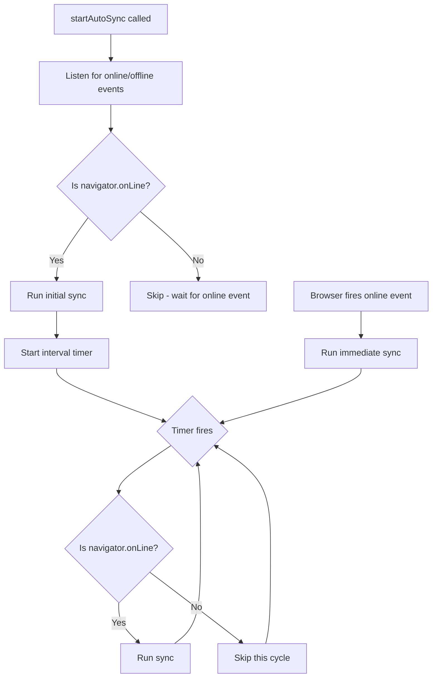

# Phase 3 — Ship a Working Library

> Initialize git, add online/offline handling, integration tests, and publish v1.0.0

---

## 3.1 Initialize Git Repo and Make First Commit

The project has no `.git` directory yet. Everything is built and verified but not version-controlled.

- `git init`
- `git add .`
- `git commit -m "feat: initial implementation — core library, tests, CI/CD, linting"`
- Create the GitHub remote and push

---

## 3.2–3.5 Online/Offline Detection

### Problem

The current [`startAutoSync()`](src/sync-service.ts:508) runs `setInterval` and blindly calls `this.sync()` every N ms — even when the browser is offline. This means:

1. Wasted cycles producing network errors
2. No auto-retry when connectivity returns
3. No visibility into online/offline state for the consuming app

### Design



### Changes to [`src/sync-service.ts`](src/sync-service.ts)

1. Add a private `isOnline` property (initialized from `navigator.onLine` if available, defaults to `true` in non-browser environments)
2. In `startAutoSync()`:
   - Register `window.addEventListener('online', ...)` and `window.addEventListener('offline', ...)`
   - Before each sync cycle, check `this.isOnline` — skip if offline
   - On `online` event, trigger an immediate sync
3. In `stopAutoSync()`:
   - Remove the online/offline event listeners
4. Add `isOnline` getter to the public API
5. Add `isOnline` field to [`SyncStatus`](src/types.ts:148)

### Changes to [`src/types.ts`](src/types.ts)

Add `isOnline: boolean` to the `SyncStatus` interface.

### Browser Compatibility Note

`navigator.onLine` and the `online`/`offline` events are available in all modern browsers and also in Node.js 18+ (via `node:net` internals). In environments where `navigator` is not available, default `isOnline` to `true` so the library still works.

---

## 3.6–3.7 Integration Test Scaffold

### Problem

All 126 existing tests mock the GitHub API. The library has never been tested against the real GitHub API.

### Design

Create an **opt-in** integration test suite in `tests/integration/` that:

1. Requires a `GITTERSYNC_TEST_TOKEN` environment variable (GitHub PAT)
2. Creates a temporary test repo on GitHub
3. Exercises the full sync cycle: init → registerCollections → pull → push → sync → compact
4. Cleans up by deleting the test repo

### File Structure

```
tests/integration/
├── setup.ts          # Helper: create/delete temp repo, authenticate
├── sync.test.ts      # Full sync cycle test
└── README.md         # How to run integration tests
```

### package.json Scripts

```json
{
  "test:integration": "vitest run --config vitest.config.integration.ts tests/integration"
}
```

A separate `vitest.config.integration.ts` with:
- No coverage (slow, unnecessary)
- Longer test timeout (real network calls)
- `test.environment: 'jsdom'` globally

### Safety

- Integration tests are **not** part of `npm test` — they must be explicitly invoked
- The CI workflow does **not** run integration tests (no token in CI)
- Each test creates a unique repo name with a `gittersync-test-` prefix
- Cleanup uses `octokit.repos.delete()` in an `afterAll` hook

---

## 3.8 Update Unit Tests

Add tests for the new online/offline behavior in `tests/sync-service.test.ts`:

- `startAutoSync()` registers online/offline event listeners
- `startAutoSync()` skips sync cycles when `navigator.onLine` is false
- `stopAutoSync()` removes event listeners
- `online` event triggers an immediate sync
- `isOnline` property reflects the current state
- `getStatus()` includes `isOnline` field
- Graceful behavior when `navigator` is not available (Node.js)

These tests mock `navigator.onLine` and `window.addEventListener`/`removeEventListener`.

---

## 3.9 Update README

Add an **Online/Offline Handling** section between **Auto-Sync** and **Binary File Sync**:

```markdown
## Online/Offline Handling

GitterSync automatically detects browser connectivity:

- When **offline**, `startAutoSync()` skips sync cycles and queues changes locally
- When **online** is restored, an immediate sync is triggered automatically
- The `isOnline` property and `getStatus().isOnline` reflect current connectivity

\`\`\`typescript
const status = sync.getStatus()
console.log(status.isOnline) // true/false

// Manual check before a sync
if (sync.isOnline) {
  await sync.push()
}
\`\`\`

> **Note:** In non-browser environments where `navigator.onLine` is unavailable, 
> GitterSync assumes online status and attempts sync normally.
```

---

## 3.10 Final Verification

```bash
npm run build && npm run lint && npm run format:check && npm test
```

All must pass before publishing.

---

## 3.11 Publish v1.0.0 to npm

```bash
npm login
npm publish --access public
```

Then create a GitHub Release with the v1.0.0 tag, which will also trigger the publish workflow.

---

## Summary of Files to Create/Modify

| File | Action | Description |
|------|--------|-------------|
| `.git/` | Create | Initialize git repository |
| `src/sync-service.ts` | Modify | Add online/offline detection, event listeners, isOnline getter |
| `src/types.ts` | Modify | Add `isOnline` to `SyncStatus` |
| `tests/sync-service.test.ts` | Modify | Add online/offline unit tests |
| `tests/integration/setup.ts` | Create | Integration test helpers |
| `tests/integration/sync.test.ts` | Create | Real GitHub API integration test |
| `tests/integration/README.md` | Create | How to run integration tests |
| `vitest.config.integration.ts` | Create | Separate vitest config for integration |
| `package.json` | Modify | Add `test:integration` script |
| `README.md` | Modify | Add Online/Offline Handling section |
